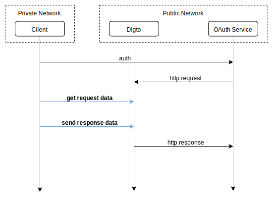

# Digto

[](https://godoc.org/github.com/ysmood/digto)
[](https://codecov.io/gh/ysmood/digto)
[](https://goreportcard.com/report/github.com/ysmood/digto)

A service to help to expose http/https service to public network for integration test.
This project helps to handle the boring part of the proxy, such automatically obtain and renew the https certificate.
So that you can easily deploy your own proxy and implement client for the proxy no matter what language you use.

For example you can easily use just `curl` command to serve public https request without any other dependency.

## Proxy a local port

Install client: `curl -L https://git.io/fjaxx | repo=ysmood/digto bin=digto sh`

Run `digto :8080 my-domain` to proxy "https://my-domain.digto.org" to port 8080

## Example Client

### `curl` only:

Open a terminal run

```bash
curl https://my-subdomain.digto.org/path -d 'ping'
# pong
```

Open another terminal run:

```bash
curl -i https://digto.org/my-subdomain
# HTTP/2 200
# digto-method: GET
# digto-url: /path
# digto-id: 3dd4e560

# ping

curl https://digto.org/my-subdomain -H 'digto-id: 3dd4e560' -d 'pong'
```

### Go

```go
package main

import (
	"bytes"
	"fmt"
	"github.com/ysmood/digto/client"
	"io/ioutil"
)

func main() {
	c := client.New("my-subdomain")

	req, res, _ := c.Next()

	data, _ := ioutil.ReadAll(req.Body)
	fmt.Println(string(data)) // output "my-data"

	res(200, nil, bytes.NewBufferString("it works"))

	// curl https://my-subdomain.digto.org -d my-data
	// output "it works"
}
```

### Node.js

```js
const digto = require('digto')

;(async() => {
	const c = digto({ subdomain: 'my-subdomain' })

	const [res, send] = await c.next()

	console.log(res) // # output "my-data"

	await send({ body: 'it works' })

	// curl https://my-subdomain.digto.org -d my-data
	// output "it works"
})()
```

### Ruby

```ruby
require 'digto'

c = Digto::Client.new 'my-subdomain'

s = c.next

puts s.body.to_s # output "my-data"

s.response(200, {}, body: 'it works')

# curl https://my-subdomain.digto.org -d my-data
# output "it works"
```

## API

A sequence OAuth diagram example:



So the only dependency for a language to implement a client is a http lib.
So usually, the client code can be only a few lines of code. This is nice to become part of auto-testing.
Such as the integration test of OAuth and payment callbacks.

### GET `/{subdomain}`

Get the request data from public.

The response is standard http response with 3 extra headers prefixed with `Digto` like:

```text
HTTP/1.1 200 OK
Digto-ID: {id}
Digto-Method: POST
Digto-URL: /callback
Other-Headers: value

<binary body>
```

Digto will proxy the rest headers transparently.

### POST `/{subdomain}`

Send the response data to public.

The request should be standard http request with 2 extra headers prefixed with `Digto` like:

```text
POST /test HTTP/1.1
Digto-ID: {id}
Digto-Status: 200
Your-Own-Headers: value

<binary body>
```

The `{id}` is required, you have to send back the `{id}` from the previous response.

### Error

If protocol level error happens the response will have the `Digto-Error: reason` header to report the reason.

## Setup private digto server

You can use my [demo server](https://digto.org) for free, you can also setup your own.

Install server: `curl -L https://git.io/fjaxx | repo=ysmood/digto bin=digto sh`

For help run `digto --help`.

Example to serve `digto serve --dns-config {token} --host test.com`

The server will add two records on your dns provider, one is like `@.test.com 1.2.3.4`,
the other one with wildcard like `*.test.com 1.2.3.4`.

For now only [dnspod](https://www.dnspod.com/?lang=en) is supported.
